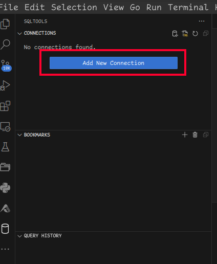

# Getting Started

## Prerequisites
- [ ] [vscode is installed](https://code.visualstudio.com/)
- [ ] [git bash is installed](https://git-scm.com/download/win)
- [ ] install recommended plugins in vscode

## Connecting to Server
- [ ] Make sure [prerequesites](#prerequesites) are met
- [ ] Navigate to connection dialog

- [ ] Select `Connect to Host`

- [ ] Select `Add New SSH Host`

- [ ] enter `ssh -i [/path/to/key] [your_name]@[server_ip_address_shared_by_em]` 
> Note: `[/path/to/key]` corresponds to the *private* key. 

In this example:
- public key `/home/em/.ssh/my_key.pub` would be shared with em (from prerequisites steps)
- private key `/home/em/.ssh/my_key` would be used in the "Connecting to Server" step: `ssh -i /home/em/.ssh/my_key em@[ip.address]`

## Open Project Folder

> NOTE: Opening the project on the server will present you with an additional `README.md` found in the root of the project- further instructions there.

Each User has their own project folder found at path `/home/[name]/data_dag`: 
Once connected through VSCode, open your project using the steps highlighted below:

